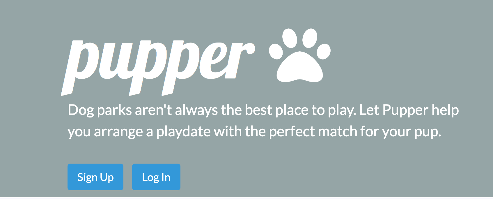
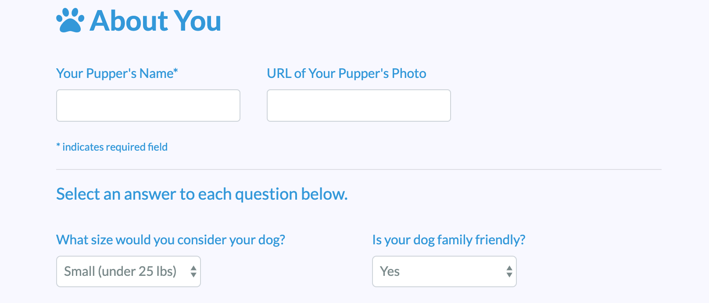
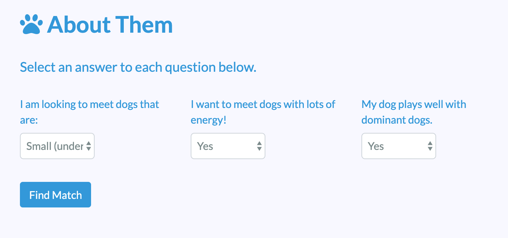
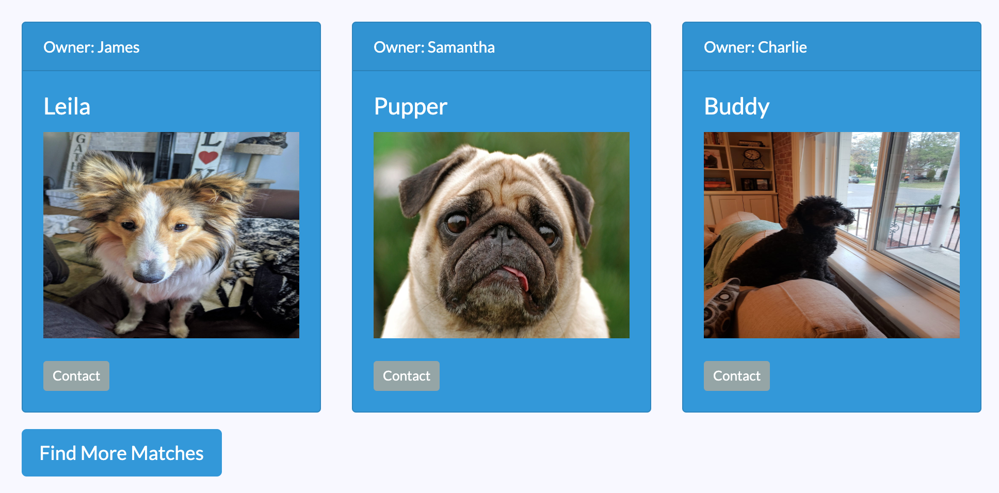
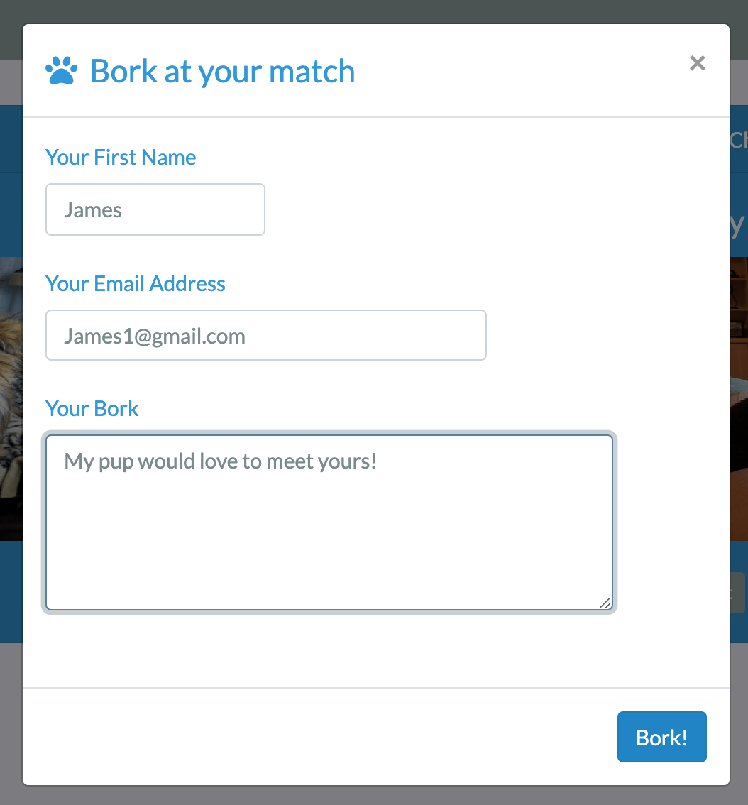

# Pupper

For this application our group used MySQL, Express, Node.js, Passport (authentication) and NodeMailer. Styling was accomplished by using Bootstrap and Bootswatch. 

* About Pupper *
Dog parks can be chaotic and overwhelming or just not the right setting for your dog to enjoy play. This is where Pupper steps in. Pupper is an app that takes in information about the owner and the dog and matches them with other dogs that may be a good fit, based on the owners ideal playmate. 

The user is first prompted to sign in (using a previously created email and password) or to sign up (if this is their first time visiting the site).
    * Using passport, the user's input will be crosschecked to ensure authentication. If their input is incorrect with our records, an error message will display asking them to please try again.

Once the log in credentials are correct, the user will be granted access to the site. To get started, two surveys will be displayed.

The **first survey** will be for the user and their pet. If the owner has a new pet they would like to add, they will need to answer all *required* fields and dog characteristic questions (if they wish to find an accurate match). 

Once the survey is complete, the user will click "submit" if they are adding a new pet or next if they have already completed a survey and wish to see matches. Both buttons will direct the user to the matches page.

The **second survey** will filter the search for matches in the database based on three common pupper characteristics:
* Desired size of playmate
* Desired Energy
* Dominancy

After submission of the form, pupper will display the most ideal playmates based on survey answers.

The owner will have two options once matches have been found:
* If the owner wishes to contact a pupper from the results, they can click the "Contact" button that will prompt a contact modal.
* If the owner wishes to find more matches with other filtering, they can click "Find More Matches" taking them back to the previous page. 

Once the owner has sent a message, the modal will close and an email will be sent directly to the user from "Pupper Contact". The email will include all information that was supplied in the contact modal. If the user emailed wishes to contact back another user back, they would do so by referecing the email address supplied through NodeMailer.

*built and designed by Claudia Falk, Charlie Parsons, Carolyn Moneymaker and Jessica Sewell.
